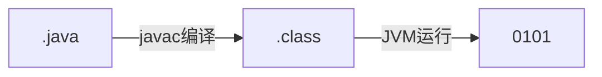

## 0. Declaration
主要内容只是自己对JavaGuide中内容的总结和提炼. 
感兴趣请直接访问他们的网站[JavaGuide](https://snailclimb.gitee.io/javaguide/#/docs/java/basis/Java%E5%9F%BA%E7%A1%80%E7%9F%A5%E8%AF%86),

## 1. JVM

### 1.1 JVM概念

JVM是Java程序在计算机中运行的中间件。 
* 在不同OS上实现相同接口,
* 其有能力运行Java字节码文件, 
* 确保相同的Java代码在不同设备上能够产生相同的行为

Java程序运行过程如下:

### 1.2 字节码概念

字节码是 JVM可以理解的代码
* 字节码只被JVM识别读取; 
* 一般保存在`.class`文件中; 
* 在不同OS上产生的字节码都是相同的 (一次编译,多次运行).

### 1.3 运行字节码

* JVM逐条运行: 
    JVM 类加载器首先加载字节码文件，然后逐行解释执行 (重复方法调用会被反复解释)
* JIT 编译器:
    JIT编译器将热点代码预先编译为机器码保存, 当需要使用时硬件可以直接执行代码 (在运行时动态编译代码, 根据上下文进行优化)
* AOT 编译器:
    AOT编译器将代码静态化编译为机器码, 类似C 和 C++的编译模式 (在运行之前编译, 没有平台独立性开发过程中不能使用动态信息)

